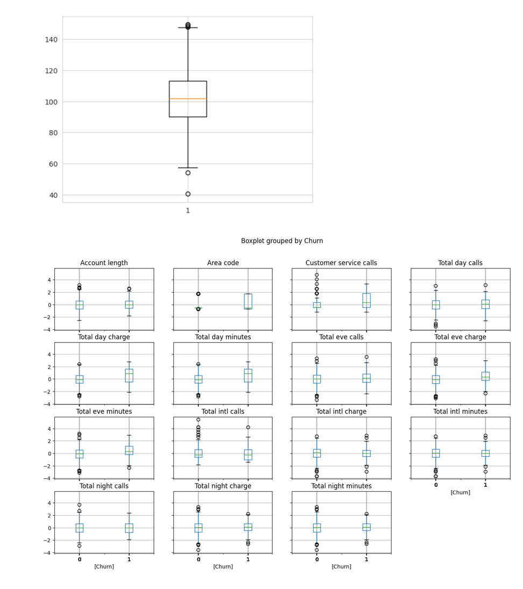
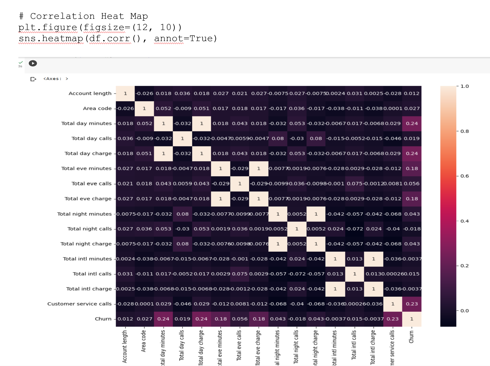

# 📊 Customer Retention Analytics System  
### Predictive Churn Intelligence for Telecom & Fintech Organizations  
**By Danielle Bopda**

---

## 📘 Table of Contents
- [1. Executive Overview](#1-executive-overview)
- [2. Business & Industry Context](#2-business--industry-context)
- [3. Data Foundation & Customer Economics](#3-data-foundation--customer-economics)
- [4. Analytical & Modeling Approach](#4-analytical--modeling-approach)
- [5. Evaluation Metrics & Business Interpretation](#5-evaluation-metrics--business-interpretation)
- [6. Visual Analysis: Customer Behavior, Risk & Revenue](#6-visual-analysis-customer-behavior-risk--revenue)
  - [6.1 Customer Behavior Distribution by Churn Status](#61-customer-behavior-distribution-by-churn-status)
  - [6.2 Feature Relationships and Revenue Signals](#62-feature-relationships-and-revenue-signals)
  - [6.3 K-Nearest Neighbors (KNN) Churn Classification](#63-k-nearest-neighbors-knn-churn-classification)
  - [6.4 Model Optimization and Error Tradeoffs](#64-model-optimization-and-error-tradeoffs)
- [7. Quantified Business Impact](#7-quantified-business-impact)
- [8. Operational Retention Strategies](#8-operational-retention-strategies)
- [9. Assumptions, Constraints & Governance Considerations](#9-assumptions-constraints--governance-considerations)
- [10. Technologies Used](#10-technologies-used)
- [11. Final Note for Recruiters & Hiring Managers](#11-final-note-for-recruiters--hiring-managers)

---

## 1. Executive Overview

Customer retention is one of the strongest drivers of profitability in telecom and fintech organizations. Subscription-based models rely on recurring revenue, yet churn is often identified only after revenue loss has already occurred.

This project delivers a **Customer Retention Analytics System** that detects churn risk early by analyzing customer usage behavior, billing patterns, and service interactions. Rather than treating churn as a historical label, the system reframes churn as a **predictable, measurable financial risk**.

The goal is not just prediction accuracy, but **decision intelligence**. The system explains why customers leave, quantifies financial exposure, and provides insights that can be directly operationalized by product, customer success, and finance teams.

---

## 2. Business & Industry Context

Telecom and fintech markets are characterized by:
- Low switching costs
- High customer expectations
- Aggressive competition
- Thin margins at scale

From a financial standpoint, churn leads to:
- Lost recurring revenue
- Increased acquisition costs
- Lower customer lifetime value
- Forecast instability
- Inefficient retention spending

Retaining customers is significantly cheaper than acquiring new ones, yet many organizations still rely on lagging churn signals such as cancellation requests. This project focuses on **leading behavioral indicators** that surface churn risk before revenue loss occurs.

---

## 3. Data Foundation & Customer Economics

The dataset represents individual customer accounts and includes:
- Account tenure
- Usage minutes and call volumes (day, evening, night, international)
- Usage-based charges
- Customer service call frequency
- Churn outcome

Each record represents a customer revenue stream. Usage and charge variables capture revenue intensity, while customer service calls reflect friction, dissatisfaction, and operational strain.

This mirrors real datasets used by telecom providers and subscription-based fintech companies, making insights directly applicable to production environments.

---

## 4. Analytical & Modeling Approach

The project follows a production-aligned workflow:

1. Data cleaning and validation  
2. Feature scaling for behavioral comparability  
3. Train-test splitting for generalization testing  
4. Churn modeling using **K-Nearest Neighbors (KNN)**  

KNN was selected because it models churn based on **behavioral similarity**, which aligns naturally with how business teams reason about customers. Customers are compared to others with similar usage, billing, and service patterns. If similar customers churned, the risk is elevated.

This approach is intuitive, explainable, and well-suited for operational decision-making.

---

## 5. Evaluation Metrics & Business Interpretation

Model performance is evaluated using both statistical and financial lenses:

- **Accuracy** measures overall correctness.
- **Precision** reflects how efficiently retention resources are deployed.
- **Recall** measures how many churners are identified early.
- **F1-score** balances precision and recall.
- **Confusion matrix** translates directly into business costs.
- **Misclassification error** represents decision risk.

The final model achieved approximately **87% accuracy**, with meaningful sensitivity to churn cases. From a revenue perspective, recall is critical because each missed churner represents avoidable revenue loss.

---

## 6. Visual Analysis: Customer Behavior, Risk & Revenue

This section connects customer behavior to churn risk and financial outcomes in a way that mirrors how analytics is reviewed in real organizations.

---

### 6.1 Customer Behavior Distribution by Churn Status

These boxplots compare behavioral metrics between churned and retained customers.

Churned customers consistently show:
- Greater variability in usage
- Higher customer service call frequency
- Different billing distributions

This confirms that churn is **behaviorally predictable**, not random. Customer service calls are particularly important, signaling dissatisfaction well before churn occurs.

---

### 6.2 Feature Relationships and Revenue Signals

The heatmap visualizes relationships between usage, billing, service interactions, and churn.

Strong correlations between usage minutes and charges validate billing mechanics. A meaningful positive correlation between customer service calls and churn highlights service friction as a leading indicator of revenue risk.

This supports prioritizing service quality improvements for high-value customers.

---

### 6.3 K-Nearest Neighbors (KNN) Churn Classification

This visualization illustrates how the KNN model classifies customers based on **behavioral similarity**.

Each customer is evaluated relative to its closest neighbors across usage, billing, and service features. If the majority of those neighbors previously churned, the customer is classified as high risk.

**What this means operationally:**
- Churn prediction is grounded in observed customer behavior, not abstract probabilities.
- The model naturally segments customers into behavioral clusters.
- Retention teams can focus on customers who resemble past churners rather than targeting broadly.

**Business value:**
This enables targeted retention strategies that preserve margins, reduce unnecessary incentives, and focus resources where churn risk is highest.

---

### 6.4 Model Optimization and Error Tradeoffs

.png)

This plot shows misclassification error across different values of **K**, the number of neighbors considered.

- Lower K values increase sensitivity but risk overfitting.
- Higher K values smooth predictions but may overlook subtle churn signals.
- The selected K minimizes misclassification error while maintaining stable predictions.

**Business interpretation:**
This optimization balances two real costs:
- Spending retention resources on customers who would not churn
- Losing customers who were not flagged in time

Choosing K is therefore a **financial decision**, not just a technical one.

---

## 7. Quantified Business Impact

Based on model performance:
- ~**87% overall accuracy**
- Meaningful early churn detection
- Reduced unnecessary retention spend
- Improved customer lifetime value forecasting

At scale, even modest churn reductions translate into substantial revenue protection.

---

## 8. Operational Retention Strategies

This system supports:
- Proactive churn alerts
- High-risk, high-value customer segmentation
- Service-quality-driven interventions
- Targeted pricing and loyalty programs

The analytics are designed to integrate directly into operational workflows.

---

## 9. Assumptions, Constraints & Governance Considerations

- Historical snapshot of behavior
- Requires retraining and monitoring in production
- Behavioral drift must be managed
- Ethical handling of customer data assumed
- Automated actions require governance oversight

---

## 10. Technologies Used

- Python  
- Pandas, NumPy  
- scikit-learn  
- Matplotlib, Seaborn  
- K-Nearest Neighbors (KNN)  

---

## 11. Final Note for Recruiters & Hiring Managers

This project demonstrates how customer data is transformed into **retention-focused decision intelligence**. It reflects real-world telecom and fintech analytics, where predictive accuracy, financial impact, and operational feasibility must align.

The emphasis is on **revenue protection, customer experience, and sustainable growth**, not just model performance.
