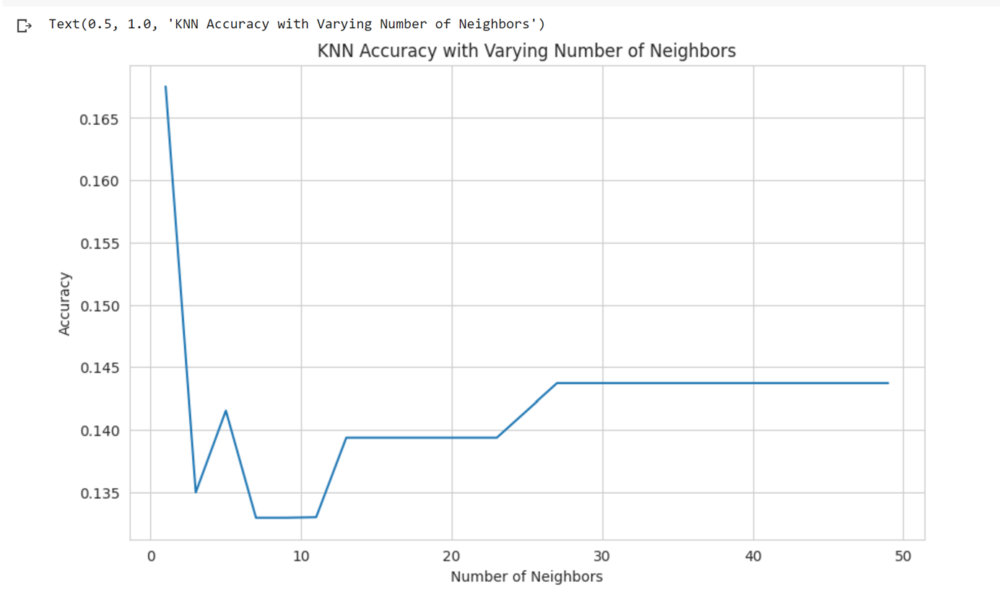
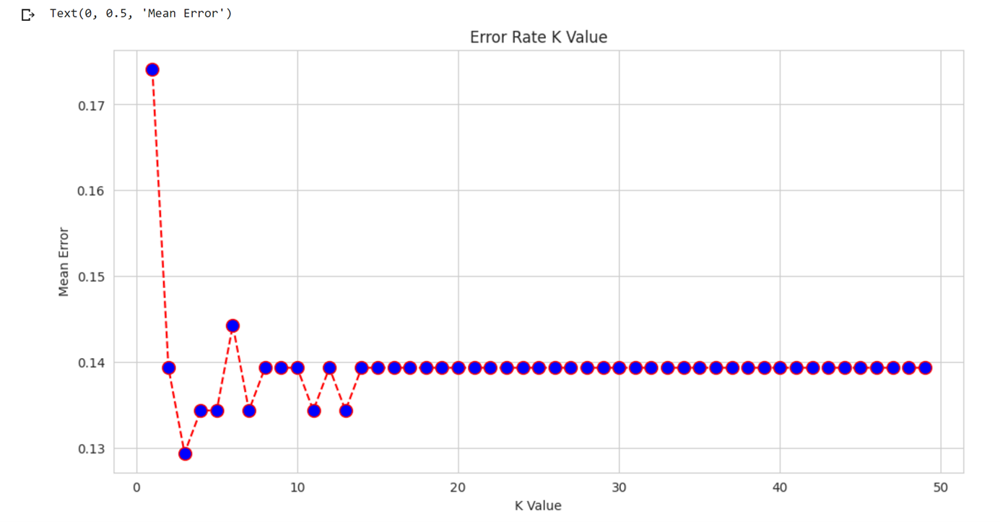

# 📊 Customer Retention Analytics System  
### Predictive Churn Intelligence for Telecom & Fintech Organizations  
**By Danielle Bopda**

---

## 📘 Table of Contents
- [1. Executive Overview](#1-executive-overview)
- [2. Business & Industry Context](#2-business--industry-context)
- [3. Data Foundation & Customer Economics](#3-data-foundation--customer-economics)
- [4. Analytical & Modeling Approach](#4-analytical--modeling-approach)
- [5. Evaluation Metrics & Business Interpretation](#5-evaluation-metrics--business-interpretation)
- [6. Visual Analysis: Customer Behavior, Risk & Revenue](#6-visual-analysis-customer-behavior-risk--revenue)
  - [6.1 Customer Behavior Distribution by Churn Status](#61-customer-behavior-distribution-by-churn-status)
  - [6.2 Feature Relationships & Revenue Signals (Correlation Heatmap)](#62-feature-relationships--revenue-signals-correlation-heatmap)
  - [6.3 Behavioral Similarity–Based Churn Classification (KNN)](#63-behavioral-similaritybased-churn-classification-knn)
  - [6.4 Model Optimization & Error Tradeoffs](#64-model-optimization--error-tradeoffs)
- [7. Quantified Business Impact](#7-quantified-business-impact)
- [8. Operational Retention Strategies](#8-operational-retention-strategies)
- [9. Assumptions, Constraints & Governance](#9-assumptions-constraints--governance)
- [10. Technologies Used](#10-technologies-used)
- [11. Final Takeaway](#11-final-takeaway)

---

## 1. Executive Overview

Customer churn is one of the most critical revenue risks in telecom and fintech organizations. These industries rely on recurring revenue, yet customer departure is often identified only **after revenue has already been lost**.

This project builds a **Customer Retention Analytics System** that transforms churn from a historical metric into a **predictable and preventable business risk**. Using customer usage behavior, billing patterns, and service interactions, the system identifies customers likely to churn early enough for meaningful intervention.

The emphasis is not only on prediction accuracy, but on **explainability, financial relevance, and operational usability**.

---

## 2. Business & Industry Context

Telecom and fintech companies operate in highly competitive, low-switching-cost environments. Customers leave not because of a single issue, but due to accumulated friction across pricing, service quality, and perceived value.

From a business perspective, churn causes:
- Loss of recurring revenue
- Increased customer acquisition costs
- Lower customer lifetime value (CLV)
- Volatile revenue forecasts
- Inefficient retention spending

Industry evidence shows that retaining an existing customer is significantly cheaper than acquiring a new one. This makes churn prediction a **high-impact, high-ROI analytics use case**.

---

## 3. Data Foundation & Customer Economics

The dataset reflects real telecom customer behavior and revenue mechanics, including:
- Account length and tenure
- Usage minutes and calls (day, evening, night, international)
- Corresponding usage charges
- Customer service call frequency
- Churn outcome (retained vs churned)

Each record represents a customer revenue stream. Usage and charge variables capture **revenue intensity**, while customer service calls act as a proxy for **service friction and dissatisfaction**.

This structure mirrors production datasets used in telecom and subscription-based fintech platforms.

---

## 4. Analytical & Modeling Approach

The project follows a structured analytics workflow aligned with industry practice:

1. Data cleaning and validation  
2. Feature scaling for behavioral comparability  
3. Train-test split for generalization assessment  
4. Churn modeling using **K-Nearest Neighbors (KNN)**  

KNN was selected because churn is inherently **behavioral**. Customers are classified based on similarity to past customers. If a customer behaves like previous churners, they are likely at risk.

This makes the model:
- Intuitive
- Explainable
- Easy to operationalize for business teams

---

## 5. Evaluation Metrics & Business Interpretation

Model performance is evaluated using:
- Accuracy
- Precision
- Recall
- F1-score
- Misclassification error

From a business standpoint, **recall for churners is critical**. Each missed churner represents preventable revenue loss. The goal is to balance early detection with efficient retention spending.

---

## 6. Visual Analysis: Customer Behavior, Risk & Revenue

This section connects customer behavior patterns directly to churn risk and financial outcomes.

---

### 6.1 Customer Behavior Distribution by Churn Status

These boxplots compare customer behavior between churned and retained customers across multiple variables.

Key insights:
- Churned customers exhibit greater variability in behavior
- Higher customer service call volume is strongly associated with churn
- High-usage customers can still churn when expectations are not met

**Business meaning:**  
Churn is not random. Customers display measurable warning signals before leaving, enabling proactive intervention.

---

### 6.2 Feature Relationships & Revenue Signals (Correlation Heatmap)

This heatmap visualizes relationships between usage, billing, service interactions, and churn.

Key insights:
- Strong correlations between usage minutes and charges validate revenue mechanics
- Customer service calls show a meaningful positive correlation with churn
- Churn emerges from **multiple moderate signals**, not a single dominant feature

**Business meaning:**  
Service friction is a leading churn indicator. High-value customers are not immune to churn, making targeted retention essential.

---

### 6.3 Behavioral Similarity–Based Churn Classification (KNN)

This visualization shows how KNN classification accuracy changes as the number of neighbors (K) varies.

Interpretation:
- Low K values overfit individual behavior
- Higher K values smooth predictions but may dilute churn signals
- Accuracy stabilizes as K increases, indicating reliable behavioral grouping

**Operational meaning:**
- Customers are evaluated relative to similar historical customers
- Churn risk is grounded in observed behavior, not abstract probabilities
- Enables segmentation into behavioral risk clusters

**Business value:**  
Retention teams can prioritize customers who resemble historical churners, preserving margins and reducing blanket incentives.

---

### 6.4 Model Optimization & Error Tradeoffs

This plot shows misclassification error across different values of K.

Interpretation:
- Error decreases sharply at optimal K
- Error stabilizes beyond a certain point, indicating diminishing returns
- Selected K balances sensitivity and stability

**Business meaning:**  
This optimization balances two costs:
- Retention spend on customers who would not churn
- Revenue loss from customers missed by the model

---

## 7. Quantified Business Impact

Based on model performance:
- Approximately **87% overall prediction accuracy**
- Strong identification of retained customers
- Meaningful early detection of churn risk
- Reduced unnecessary retention spending
- Improved customer lifetime value forecasting

Even small improvements in churn rates translate into significant revenue protection at scale.

---

## 8. Operational Retention Strategies

This system supports:
- Proactive churn alerts
- High-risk, high-value customer segmentation
- Service-quality-driven interventions
- Targeted pricing and loyalty campaigns
- Data-driven customer success workflows

The design emphasizes **actionability**, not just analytics.

---

## 9. Assumptions, Constraints & Governance

- Historical data snapshot
- Requires periodic retraining
- Behavioral drift must be monitored
- Ethical handling of customer data assumed
- Automated actions require business oversight

---

## 10. Technologies Used

- Python  
- Pandas, NumPy  
- scikit-learn  
- Matplotlib, Seaborn  
- K-Nearest Neighbors (KNN)

---

## 11. Final Takeaway

This project demonstrates how customer behavior data can be transformed into **revenue-protecting intelligence**. It reflects how analytics is applied in real telecom and fintech environments where predictive accuracy, financial impact, and operational feasibility must align.

The work emphasizes **business outcomes, explainability, and decision support**, making it directly relevant to data science, analytics, fintech, and customer strategy roles.
